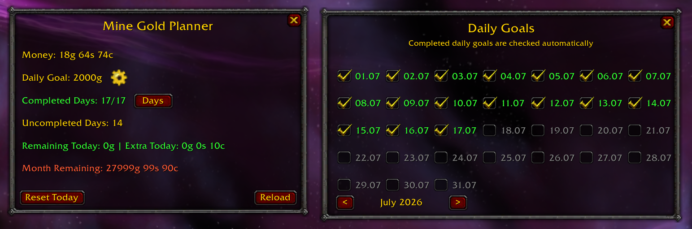

# MineGoldPlanner

MineGoldPlanner is a lightweight gold goal tracker for World of Warcraft: TBC Anniversary.

Set a daily gold goal, track your progress throughout the month, and mark completed days using a simple in-game calendar.

## Screenshot



## Features

- Custom daily gold goal
- Automatic tracking of earned gold
- Remaining gold calculation for the current day
- Monthly remaining goal calculation
- Automatic completion of daily goals
- Manual daily completion checkboxes
- Calendar history with month navigation
- Movable interface windows
- Draggable minimap button
- Saved progress and window positions
- Automatic restoration of the main window after `/reload`

## Installation

1. Download `MineGoldPlanner-v0.1.0.zip` from the [latest release](../../releases/latest).
2. Extract the archive.
3. Copy the `MineGoldPlanner` folder into:

```text
World of Warcraft/_anniversary_/Interface/AddOns/
```

4. The final path should look like:

```text
World of Warcraft/_anniversary_/Interface/AddOns/MineGoldPlanner/MineGoldPlanner.toc
```

5. Start World of Warcraft and enable MineGoldPlanner in the AddOns menu.

## How It Works

### Daily Goal

Use the gear button next to **Daily Goal** to change your current gold target.

### Remaining Today

Shows how much more gold is required to complete all unfinished goals up to the current day.

If the required amount has already been earned, the addon displays **Extra Today** instead.

### Month Remaining

Shows the total amount of gold still required for the current month. It includes unfinished previous days, the current day, and future daily goals.

### Daily Goals Calendar

Press **Days** to open the calendar.

- Green dates are completed.
- Red dates are unfinished.
- Gray dates cannot be edited.
- Past months can be viewed but cannot be changed.
- Calendar history is limited to one year backward and one year forward.

When enough gold is earned, the addon automatically completes the oldest unfinished available day.

### Reset Today

**Reset Today** clears the gold progress tracked during the current day and starts tracking again from the character's current balance.

Automatically added checkmarks from the current day are also removed. Manually selected checkmarks are preserved.

## Gold Tracking

MineGoldPlanner tracks increases from each character's starting balance for the current day.

The addon remembers the highest balance reached by each character. This prevents ordinary purchases, bank withdrawals, and moving gold between characters from being counted repeatedly as new earnings.

Gold earned before the addon establishes its daily starting balance is not counted.

## Controls

- Click the minimap button to show or hide the main window.
- Drag the minimap button to move it.
- Drag addon windows to reposition them.
- Press `Esc` to close an open addon window.
- Press **Reload** to reload the game interface.

## Compatibility

Designed for World of Warcraft: TBC Anniversary.

Interface version:

```text
20506
```

## Version

Current release: `v0.1.0`

## Development

Designed, tested, and iteratively developed with AI-assisted implementation.

## License

This project is available under the [MIT License](LICENSE).

